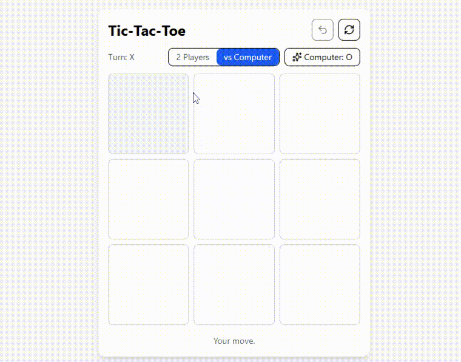

# 🎮 React Tic-Tac-Toe Game

🔗 **Live Demo:** https://tictactoe-app-theta.vercel.app  
🌐 **Portfolio:** https://gaurangkumar-patel.github.io/portfolio  
💼 **LinkedIn:** https://www.linkedin.com/in/gaurangpatel2326  

An interactive **Tic-Tac-Toe web application built with React** featuring **2 Players mode** and **Play vs Computer (AI)**.  
This project demonstrates clean component-based architecture, state management using React Hooks, and production-ready deployment.

---

## 🧠 Project Overview (For Recruiters)

This project showcases:
- Strong fundamentals in **React & modern JavaScript**
- Game logic implementation with **winner detection & AI**
- Clean, readable, and reusable code structure
- Focus on **UI/UX, animations, and performance**
- End-to-end workflow: development → deployment

It is designed as a **portfolio-ready frontend project** suitable for entry to mid-level React / Frontend roles.

---

## 🎥 Demo Preview




---

## 🚀 Features

* 🎮 **Game Modes**

  * 👥 2 Players mode
  * 🤖 Play vs Computer (Easy AI)
* 🏆 Automatic winner detection
* ✨ Winning line highlight
* 🔄 Undo last move
* ♻️ Restart game anytime
* 🎨 Clean, modern UI with animations
* ⚡ Fast build and optimized performance using Vite
* 🌐 Deployed on Vercel

---

## 🕹 How to Play

1. Select **2 Players** or **vs Computer** mode.
2. Click on any square to place your mark (X or O).
3. First player to align **3 marks in a row** wins.
4. Use **Undo** to revert the last move.
5. Click **Restart** to reset the game.

---

## 🛠 Tech Stack

* **React** (Hooks-based architecture)
* **Vite** – fast development & build tool
* **JavaScript (ES6+)**
* **Tailwind CSS** – responsive styling
* **Framer Motion** – UI animations
* **Lucide React** – icons
* **Vercel** – deployment

---

## 📂 Project Structure

```
tictactoe-app/
├── src/
│   ├── App.jsx          # Application entry point
│   ├── TicTacToe.jsx    # Core game logic & UI
│   ├── index.css        # Tailwind styles
│   └── main.jsx         # React DOM entry
├── index.html
├── package.json
├── tailwind.config.js
├── postcss.config.js
└── README.md
```

---

## 📦 Installation & Local Setup

```
# Clone the repository
git clone https://github.com/gaurangkumar-patel/tictactoe-app.git

# Navigate to project directory
cd tictactoe-app

# Install dependencies
npm install

# Start development server
npm run dev

```

📍 Application will run at:
`http://localhost:5173`

---

## 🌐 Deployment

The application is deployed using **Vercel**.

**Build details:**

* Framework: Vite
* Build Command: `npm run build`
* Output Directory: `dist`

🔗 Live URL:
[https://tictactoe-app-theta.vercel.app](https://tictactoe-app-theta.vercel.app)

---

## 📈 Future Enhancements

* Smarter AI using Minimax algorithm
* Difficulty levels (Easy / Medium / Hard)
* Scoreboard & match history
* Sound effects & animations
* Mobile-first optimizations

---

## 👨‍💻 Author

**Gaurangkumar Patel**
MSc in IT | Full-Stack Developer

**Skills:**
React, JavaScript, PHP (Laravel, Yii2), MySQL, REST APIs, AWS basics

🔗 Portfolio: [https://gaurangkumar-patel.github.io/portfolio](https://gaurangkumar-patel.github.io/portfolio)
💼 LinkedIn: [https://www.linkedin.com/in/gaurangpatel2326](https://www.linkedin.com/in/gaurangpatel2326)
🐙 GitHub: [https://github.com/gaurangkumar-patel](https://github.com/gaurangkumar-patel)

---
